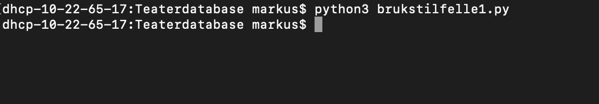
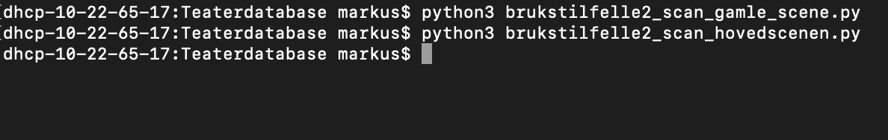
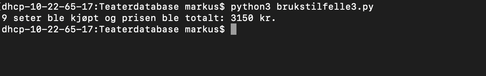
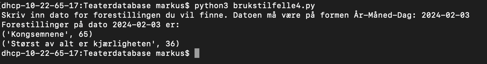
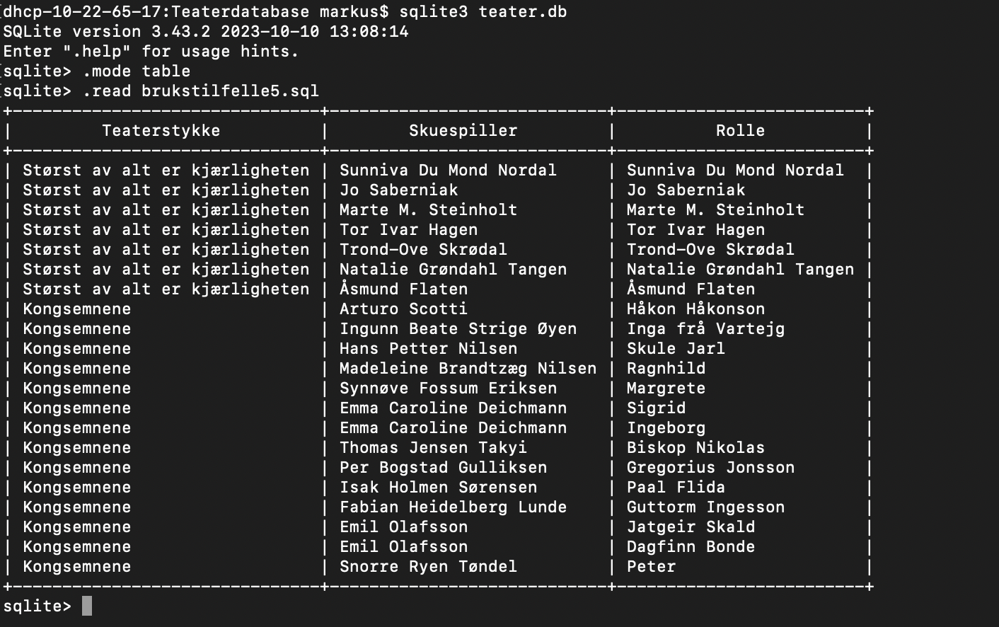
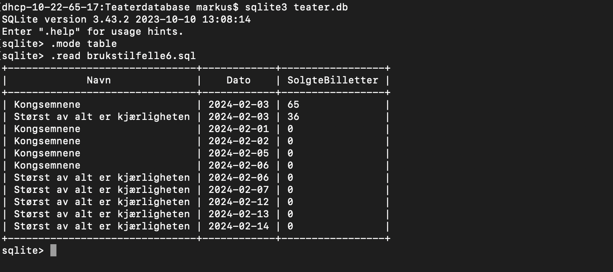
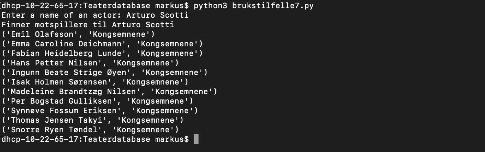

# Gruppe 109 prosjektoppgave, Teaterdatabase

**Sigurd Hagen, Markus Klund og Markus Helbæk**

## Innholdsfortegnelse

- Brukstilfelle 1
- Brukstilfelle 2
- Brukstilfelle 3
- Brukstilfelle 4
- Brukstilfelle 5
- Brukstilfelle 6
- Brukstilfelle 7
- Antagelser
- Endringer
  
Denne [README.md](./README.md) filen er en beskrivelse på hvordan kjøring av scriptene skal gjennomføres. 

#### Brukstilfelle 1

For å få insatt data for saler, stoler, stykkene etc. i databasen vår må en kjøre [brukstilfelle1](./brukstilfelle1.py). Etter kjøring av dette scriptet vil det i den eksistererende [teater.db](./teater.db) bli insatt en rekke data. Databasen [teater.db](./teater.db) kan vises med verktøy som **DB Browser for SQLite**.

Insettingen av dataen for saler, stoler, stykker etc. til [teater.db](./teater.db) må skje før de andre brukstilfellene kjøres. Det å kjøre scriptet flere ganger vil være uhensiktsmessig da de insatte datene allerede er satt inn.
Tekstlig resultat for brukstilfelle 1:

#### Brukstilfelle 2

Både [brukstilfelle2_scan_gamle_scene.py](./brukstilfelle2_scan_gamle_scene.py) og [brukstilfelle2_scan_hovedscenen.py](./brukstilfelle2_scan_hovedscenen.py) svarer på brukerhistorie 2. [brukstilfelle2_scan_gamle_scene.py](./brukstilfelle2_scan_gamle_scene.py) vil se igjennom filen [gamle-scene.txt](./gamle-scene.txt) sete for sete og vil for opptatte seter sette inn et kjøp i databasen på en bruker kalt *Dummy profile 1*. Tilsvarende er det for [brukstilfelle2_scan_hovedscenen.py](./brukstilfelle2_scan_hovedscenen.py) som vil se igjennom filen [hovedscenen.txt](./hovedscenen.txt).

Så lenge [brukstilfelle1.py](./brukstilfelle1.py) er kjørt kan man kjøre denne filen når som  helst. Det å kjøre scriptet flere ganger vil være uhensiktsmessig da de insatte dataene allerede er satt inn.
Tekstlig resultat for brukstilfelle 2:

#### Brukstilfelle 3

Når en kjører [brukstilfelle3.py](./brukstilfelle3.py) vil scriptet hvis det finnes en rad med 9 ledige seter kjøpe 9 seter på samme rad. Kjøpene blir registrert på en bruker kalt *Dummy profile 2*. Summen av billettprisen vil da vises i terminalen.

Så lenge [brukstilfelle1.py](./brukstilfelle1.py) er kjørt kan man kjøre denne filen når som  helst. Man kan kjøre scriptet flere ganger.
Tekstlig resultat for brukstilfelle 3:

#### Brukstilfelle 4

[brukstilfelle4.py](./brukstilfelle3.py) vil i terminalen spørre om en dato på formen År-Måned-Dag, for eksempel 2024-02-03. Resultatet er da de forestillingene som vises på denne datoen samt antall billetter kjøpt for denne forestillingen.

Scriptet kan kjøres når som helst så mange ganger man vil.
Tekstlig resultat for brukstilfelle 4:

#### Brukstilfelle 5

[brukstilfelle5.sql](./brukstilfelle5.sql) finner navn på alle skuespillerne som opptrer i de forskjellige teaterstykkene. Kan kjøres når som helst så mange ganger man vil.
Tekstlig resultat for brukstilfelle 5:

#### Brukstilfelle 6

[brukstilfelle6.sql](./brukstilfelle6.sql) finner og sorterer alle forestillingen basert på antall solgte billetter. Kan kjøres når som helst så mange ganger man vil.
Tekstlig resultat for brukstilfelle 6:

#### Brukstilfelle 7

[brukstilfelle7.py](./brukstilfelle7.py) finner alle skuespillere som har spilt i samme akt samt hvilke forestilling de spilte sammen i basert på et navn. Kan kjøres når som helst så mange ganger man vil.
Tekstlig resultat for brukstilfelle 7:

## Antagelser

1. Størst av alt er kjærligheten har én akt
2. Antar at skuespiller er det som oppgis som medvirkende på nettsiden, og medvirkende er det som oppgis som kunstnerisk lag
3. Antar at ansattes epost er av typen: fornavn.etternavn@trondelagteater.no.
4. Ansattstatus til en skuespiller bestemmes ut ifra om de deltar på to eller flere stykker for vår 2024.
5. Ansattstatus for medvirkende bestemmes ut ifra gitt informasjon om brukeren og gruppas subjektive tolkning av denne informasjonen.
6. Vi baserer oss på Kongsemene-rollene som står i oppgavedokumentet. Der står rollen Guttorm Ingesson. Denne rollen blir derimot ikke spilt av noen skuespillere på nettsiden. Siden det står at Fabian Heidelberg Lunde spiller rollen Baard Bratte, som ikke nevnes i oppgavedokumentet, velger vi å legge inn at Fabian Lunde spiller rollen Guttorm Ingesson.
7. I oppgavedokumentet nevnes rollen Ingeborg, mens det på nettsiden står Ingebjørg, men ingen Ingeborg. Tolker det som at disse refererer til samme rolle,og lar Emma Caroline Deichmann spille Ingeborg

## Endringer

Det er gjort et par endringer siden innleveringen av DB1.I [databaseprosjekt.slq](./databaseprosjekt.sql) har billettType og pris blitt satt som fremmednøkkler til Gruppe og TillaterGruppe. Det er også blitt lagt til nye *INSERT* queries til [insert-db.sql](./insert-db.sql) som setter inn alle verdiene for bilettType og pris.
